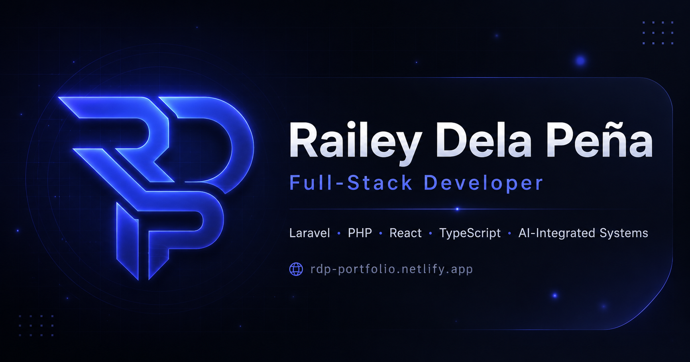

<p align="center">
  
</p>

<h1 align="center">RDP Portfolio</h1>

<p align="center">
  Personal developer portfolio of <strong>Railey Dela Peña</strong>, showcasing web systems, AI-integrated platforms, developer tools, and full-stack projects.
</p>

<p align="center">
  <a href="https://rdp-portfolio.netlify.app" target="_blank">
    <strong>Live Portfolio</strong>
  </a>
</p>

<p align="center">
  
  
  
  
</p>

---

## Overview

This portfolio presents my background, skills, selected projects, resume, and contact links in a modern dark interface. It highlights my work as a full-stack developer focused on PHP/Laravel systems, React and TypeScript interfaces, CLI tooling, and AI-assisted workflows.

Live site: [https://rdp-portfolio.netlify.app](https://rdp-portfolio.netlify.app)

---

## Features

- Modern dark UI with an indigo-accented visual palette
- Animated hero text with typing and backspacing effect
- Interactive cursor particle background
- Responsive layout for desktop, tablet, and mobile screens
- Project cards with optional external project links
- Resume preview with view and download actions
- Contact section with email, GitHub, LinkedIn, and resume access
- Open Graph-ready branding using `public/logo/og_logo.png`

---

## Tech Stack

- React
- TypeScript
- Tailwind CSS
- Vite
- Lucide React Icons
- Netlify

---

## Featured Projects

### Formless AI

AI-powered form automation tool that fills online forms using OpenAI and Mistral models.

### e-Docs

Institutional document management system built for City College of Calamba (CCC), supporting research, extension, planning, and quality assurance workflows with AI-assisted document review and decision support.

### Applicant Management System

Recruitment platform for Staff Search Asia with applicant-job matching, shortlisting, job posting, and analytics dashboards.

### Scafkit CLI

npm-based scaffolding and build helper for PHP MVC, PERN, React, and Laravel workflows. It generates starter projects, automates local tooling, and packages Laravel apps for deployment.

### e-Formatter

Research manuscript formatter built for City College of Calamba (CCC), designed to format academic papers based on CCC guidelines and selected international conference standards.

### Resumakr

Resume builder with live preview and export functionality using a clean React and TypeScript component architecture.

---

## Getting Started

Clone the repository:

```bash
git clone https://github.com/RaileySawada/rdp-portfolio.git
```

Go to the project directory:

```bash
cd rdp-portfolio
```

Install dependencies:

```bash
npm install
```

Start the development server:

```bash
npm run dev
```

Build for production:

```bash
npm run build
```

Preview the production build:

```bash
npm run preview
```

---

## Project Structure

```text
rdp-portfolio/
├─ public/
│  ├─ logo/
│  │  └─ og_logo.png
│  └─ resume/
│     └─ RaileyDelaPena.pdf
├─ src/
│  ├─ components/
│  ├─ layouts/
│  ├─ lib/
│  │  └─ content.ts
│  ├─ pages/
│  ├─ App.tsx
│  ├─ main.tsx
│  └─ index.css
├─ package.json
└─ README.md
```

---

## Open Graph Image

The main branding and preview asset is located at:

```text
public/logo/og_logo.png
```

This image is also used as the README banner.

---

## Contact

- Portfolio: [https://rdp-portfolio.netlify.app](https://rdp-portfolio.netlify.app)
- GitHub: [https://github.com/RaileySawada](https://github.com/RaileySawada)
- LinkedIn: [https://www.linkedin.com/in/railey-dela-pe%C3%B1a-451a11372/](https://www.linkedin.com/in/railey-dela-pe%C3%B1a-451a11372/)

---

## Author

Developed by **Railey Dela Peña**.
